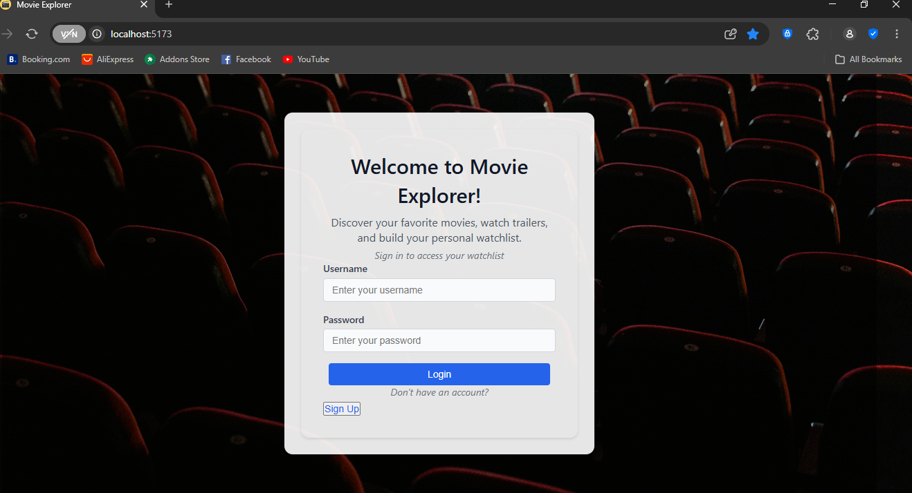
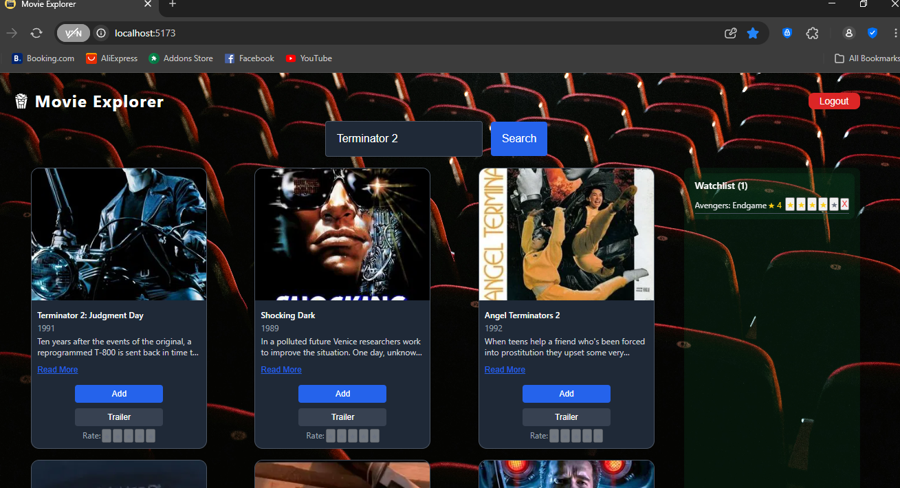

# Movie Explorer

A full-stack web application for browsing, searching, and managing a personalized movie watchlist with ratings, built with React, Vite, Node.js, Express, and PostgreSQL. Users can search for movies using The Movie Database (TMDB) API, add/remove movies from their watchlist, rate movies, and watch trailers.

**Login/Signup Page**


**Home Page**


## Features
- **Search Movies**: Search movies via TMDB API with a responsive search bar.
- **Watchlist Management**: Add/remove movies to/from a personalized watchlist.
- **Movie Ratings**: Rate movies (1-5 stars) in the watchlist.
- **Trailer Playback**: View movie trailers in a modal with YouTube embeds.
- **Responsive Design**: Optimized for mobile (375px), tablet (768px), and desktop (1280px).
- **Authentication**: Secure signup/login with session-based authentication.
- **Accessible UI**: ARIA labels and semantic HTML for accessibility.
- **Dark Theme**: Movie-themed UI with a transparent auth form.

## Tech Stack
- **Frontend**: React, Vite, Axios, CSS (with Stylelint)
- **Backend**: Node.js, Express, PostgreSQL, Express-Session
- **APIs**: The Movie Database (TMDB)
- **Deployment**: Netlify (frontend), Render (backend)
- **Tools**: Git, VS Code, Postman

## Installation

### Prerequisites
- Node.js (v16 or higher)
- PostgreSQL (v12 or higher)

### Frontend Setup
1. Clone the repository:
   ```bash
   git clone https://github.com/Nateliso/movie-explorer.git
   cd movie-explorer/frontend